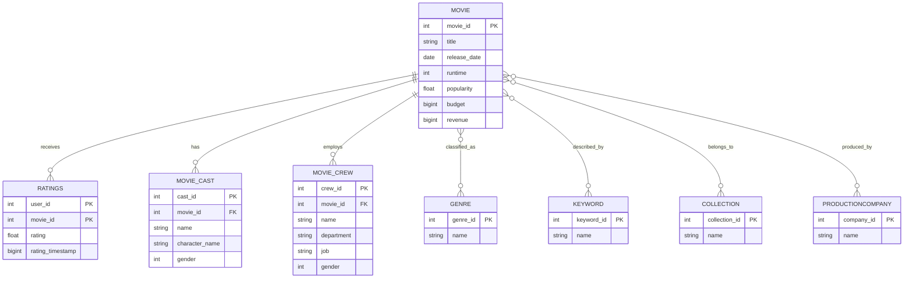

# Relational Database & Data Processing Project

This project presents the design, organization, and analysis of a **relational database system** built on a real-world movie dataset.

The work combines automated data ingestion, relational modeling, SQL querying, and data preprocessing using Python.

---

## Project Overview

The database was initially created by importing multiple CSV datasets into an Azure SQL database, where table structures were generated automatically by the system.

Subsequently, relational constraints and data relationships were defined explicitly, and analytical SQL queries were developed to explore the dataset.

For documentation and reproducibility purposes, the database schema has been reconstructed and is included in this repository.

---

## Dataset Description

The dataset represents a movie domain and includes information about:

- Movies
- Ratings
- Genres
- Keywords
- Collections
- Production companies
- Cast and crew members

Several many-to-many relationships are present and are modeled using junction tables.

---

## Database Schema

The relational schema includes:

- Core entity tables (e.g. movies, genres, ratings)
- Junction tables for many-to-many relationships
- Primary and foreign key constraints

The reconstructed schema can be found in:  schema/reconstructed_schema.sql

This schema reflects the final logical structure of the database after data import and constraint definition.

---

## Entity–Relationship Diagram

---

## SQL Queries

A set of SQL queries was developed to perform:

- Data retrieval and filtering
- Aggregations and statistics
- Joins across related entities

All queries are available in:  queries/queries.sql

---

## Data Processing Scripts

Python scripts were developed to support data preprocessing and analysis, including:

- Transformation of raw JSON data into flat tables
- Data exploration and visualization

Scripts are located in:  scripts/

---

## Project Structure

relational-database-project/  
├── schema/ → Reconstructed database schema  
├── queries/ → SQL queries  
├── data/ → CSV datasets  
├── scripts/ → Python preprocessing and analysis scripts  
└── README.md  

