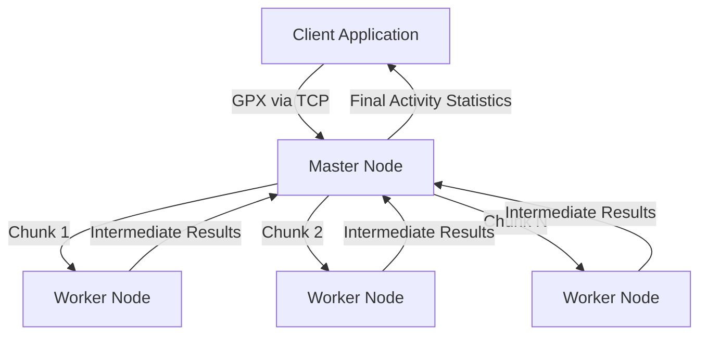

# Distributed Activity Tracker (MapReduce-based System)

This project implements a **distributed backend system for activity tracking and analysis**, inspired by real-world platforms such as Strava.

It was developed as part of the *Distributed Systems* course and focuses on parallel data processing, TCP-based communication, and synchronization in a master–worker architecture.

---

## Problem Overview

Users upload recorded physical activities in the form of **GPX files**, which consist of GPS waypoints (latitude, longitude, elevation, timestamp).

Due to the potentially large size of these files, the system processes the data **in parallel** using a MapReduce-like approach in order to compute activity statistics efficiently.

---

## System Architecture

The system follows a **master–worker distributed architecture**:

- A **Client** submits a GPX activity file to the system
- A **Master node** coordinates the processing
- Multiple **Worker nodes** process parts of the data in parallel

The Master node also acts as the **Reducer**, combining intermediate results into final activity statistics.

---

## How to Run

1. Start the **Master** node using the provided configuration file.
2. Launch one or more **Worker** nodes and connect them to the Master.
3. Run the **Client** application.
4. The Client loads a GPX activity file from its `resources/` directory and submits it to the Master.
5. The Master distributes the workload across Workers, performs the reduce phase, and returns the final activity statistics to the Client.

> GPX files represent complete recorded activities and are processed as a single task per execution.

---

## Architecture Diagram

---

## Data Processing Model (MapReduce)

1. The Master node splits the GPX file into chunks of *N waypoints*
2. Chunks are distributed to Workers using **round-robin scheduling**
3. Each Worker computes intermediate results:
   - Total distance
   - Average speed
   - Total elevation gain
   - Total activity time
4. Workers return intermediate results to the Master
5. The Master performs the **reduce phase** and produces the final results

---

## Communication Model

- Communication is implemented **exclusively using TCP sockets**
- The Master node runs as a TCP server
- Workers connect to the Master via TCP
- The Client maintains an open TCP connection until results are returned
- All communication is handled asynchronously using threads

---

## Concurrency & Synchronization

- The Master and Workers are **multithreaded**
- Synchronization is handled using:
  - `synchronized`
  - `wait()` / `notify()`
- No usage of `java.util.concurrent` utilities, as required by the assignment

---

## Project Structure

distributed-activity-tracker/  
   ├── master/ → Task coordination, reduce phase, statistics  
   ├── worker/ → Parallel processing of GPX chunks (map phase)  
   └── client/ → GPX submission and result retrieval  

Each component is documented in its respective directory.

---

## Technologies Used

- Java 8 (Oracle JDK)
- TCP Sockets
- Multithreading
- Object-oriented design

---

## Limitations

- User statistics are stored **in memory only**
- No persistent storage or database is used
- Some global statistics features were not fully implemented

---

## Academic Context

This project was developed for academic purposes as part of a university course on Distributed Systems.
